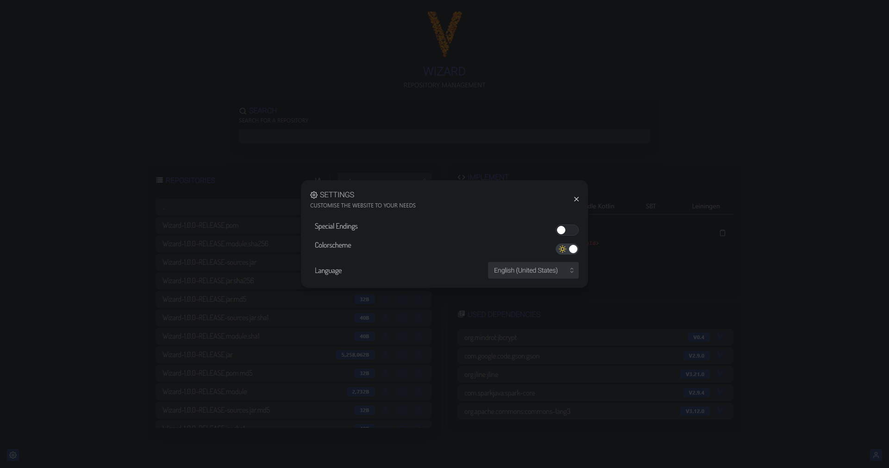

## Wizard [🚀️]

###### *Wizard is a light-weight repository management tool for processing implementations in frameworks like <br /> [Apache Maven](https://maven.apache.org/), [Apache Ivy](https://ant.apache.org/ivy/), [Apache BuildR](https://buildr.apache.org/), [Gradle Groovy](https://gradle.org/), [Gradle Kotlin](https://kotlinlang.org/docs/gradle.html), [SBT](https://www.scala-sbt.org/) and [Leiningen](https://leiningen.org/).*

### Navigation

* [About](#about)
* [Features](#features)
* [Requirements](#requirements)
* [Documentation](#documentation)
* [Preview Images](#images)
* [Installation using Docker](#installation-using-docker)
## About [❤]

<a id="about"></a>
Wizard is a small repository management tool published by the developer group [VountyNetwork](https://vounty.net). <br />
With built-in security systems and future-oriented frameworks, Wizard is the perfect tool for your projects.

## Features [🎉️]

<a id="features"></a>

* ✅ Simple and easy to use command line interface (CLI)
* ✅ Light-speed installation
* ✅ Manage your own repositories
* ✅ Unlimited tokens for deployment
* ✅ Smooth and modern web design
* ✅ SSL certificate support
* ✅ Realtime search on web
* ✅ Simple RESTful API
* ✅ Customizeable web overview
* ✅ Multiple framework support

## Requirements [📓]

* Internet connection
* **Java 16** or higher
* Enough memory
* Browser

<a id="requirements"></a>

## Documentation [📰]

Documentation on installing and using **Wizard** can be found on the [official documentation website from VountyNetwork](https://docs.vounty.net/).

<a id="documentation"></a>

## Preview Images [👀️]

<a id="images"></a>





## Installation using Docker


```shell 
git pull https://github.com/VountyNetwork/Wizard
cd ./Wizard
docker compose build
docker compose run --rm --service-ports -d vounty-wizard ghci
```
This will start Wizard in detached mode. In order to attach it to your default output use

```shell
 docker attach wizard_vounty-wizard_run_[id]
```

[id] should be replaced by the container id, we recommend to press [TAB] after ...run_.\
To exit attached mode press `[CTRL] + P & [CTRL] + Q`

The config can be accessed under `/var/lib/docker/volumes/wizard_data/_data`
